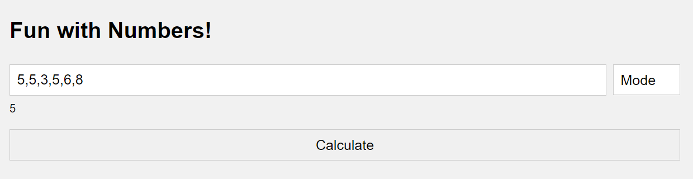

# FunWithMaths
 build a web application that will allow us to understand what Switch Statements are and when we should use them. For this web application, we will calculate number statistics given a range of numbers keyed in by the user. The application will consist of an input and a button element. We will be writing external CSS and JavaScript for this project. 

The web application will take in a list of numbers that the user will enter. These numbers can be placed in any order separated by a comma. Once the user has entered their numbers, users can use the input to choose the type of statistics they would like to calculate from the list of numbers they have entered. From there, we can use the Switch Statement to determine which formula we would want to apply to the list of numbers provided to us. 

We will not be using any framework for this project, but instead, we will be using VanillaJS to interact with the Document Object Model using the document keyword. Now let’s get started!

# Learning Outcomes
By the end of this project, you will be able to:
  - Use Switch Statements to apply the appropriate formula
  - Obtain values from the HTML DOM
  - Apply the “default” use case on the Switch Statements
